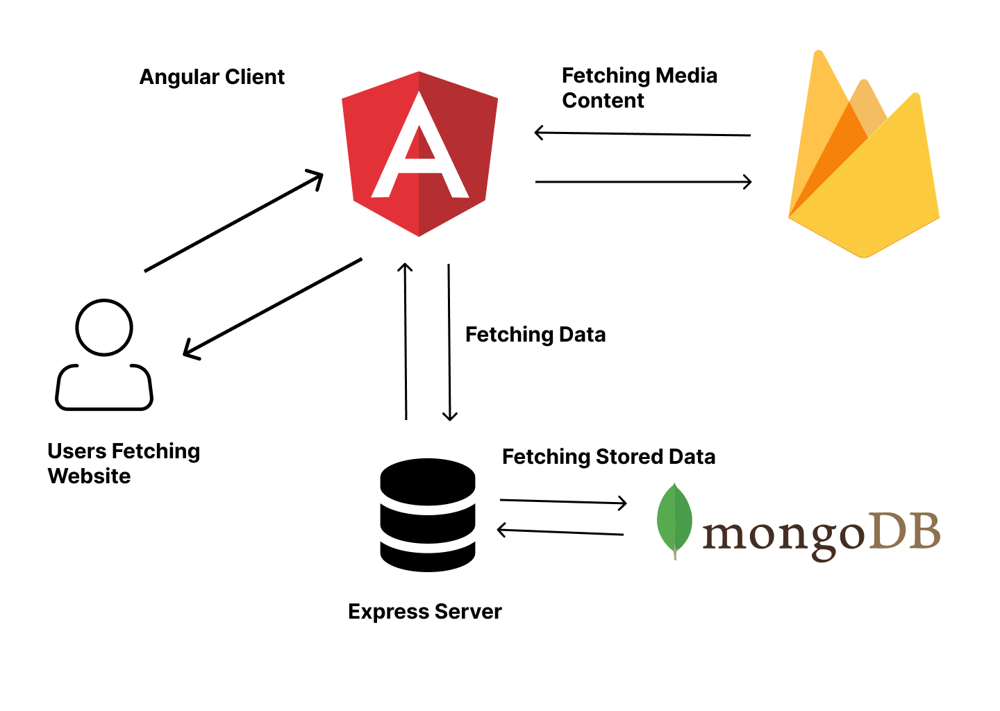
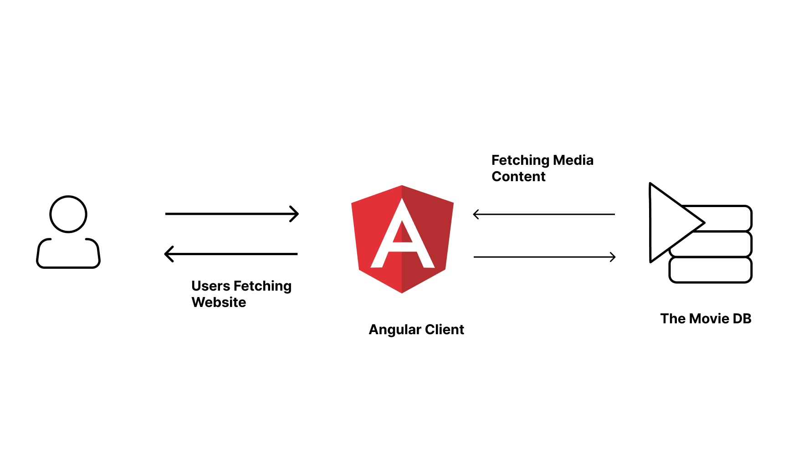

# Movie Dashboard

## Installation

1. Clone the Repository
2. Run `npm install`
3. Run `ng serve` and open browser in localhost:4200

## Architecture
### Ideal Plan  

 

### Working Architecture  

 

## Libraries used
### Frontend

<ul>
<li>Firebase - Used to Store images and trailers</li>
<li>moviedb-promise - Used to get Movie Details</li>
<li>Angular Material - Used to create clean and elegant looking components</li>
</ul>

### Backend

<ul>
<li>cors - Used for Cross Origin Data Transfer</li>
<li>dotenv -  To access environment variables</li>
<li>express - Used to make Express App</li>
<li>Mongodb - Used to store data</li>
<li>Nodemon - Used for development purposes for auto restart of server if any change is detected</li>
</ul>

## Thought process

Firebase firestore is used to store the media content(images and trailer) of movies. Postman is used to post the data from client side to MongoDB Atlas. Angular fetches the data from mongodb using an Express Server and serves the data to the frontend.

## Design Choices

Angular Material is used here because the components are quite clean and easy to use. A Grid View is used to display movie cards in the App.

## Optimization

1.) Use OnPush Change Detection Strategy 
2.) Detach Change Detection/ngzone 
3.) Use pure pipe 
4.) Use Web workers 
5.) Preload modules